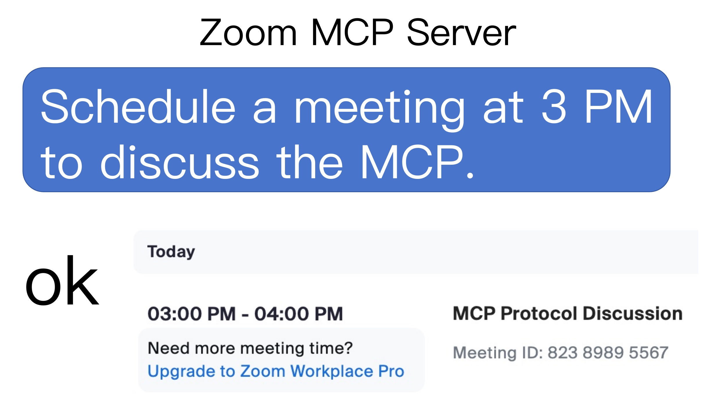

[](https://mseep.ai/app/javaprogrammerlb-zoom-mcp-server)

# Zoom MCP Server

[](https://www.npmjs.com/package/@yitianyigexiangfa/zoom-mcp-server)  [](https://smithery.ai/server/@JavaProgrammerLB/zoom-mcp-server) 

Now you can date a Zoom meeting with AI's help


## Usage

### 1. list meetings

- `list my meetings`
- `list my upcoming meetings`

### 2. create a meeting

- `Schedule a meeting at today 3 pm with a introduce mcp topic`

### 3. delete a meeting

- `delete the latest meeting`
- `delete the 86226580854 meeting`

### 4. get a meeting detail

- `Retrieve the latest meeting's details`
- `Retrieve 86226580854 meeting's details`

## Usage with VS Code
 [](https://insiders.vscode.dev/redirect/mcp/install?name=zoom-mcp-server&inputs=%5B%7B%22type%22%3A%22promptString%22%2C%22id%22%3A%22ZOOM_ACCOUNT_ID%22%7D%2C%20%7B%22type%22%3A%22promptString%22%2C%22id%22%3A%22ZOOM_CLIENT_ID%22%7D%2C%20%7B%22type%22%3A%22promptString%22%2C%22id%22%3A%22ZOOM_CLIENT_SECRET%22%7D%5D&config=%7B%22command%22%3A%22npx%22%2C%22args%22%3A%5B%22-y%22%2C%22%40yitianyigexiangfa%2Fzoom-mcp-server%40latest%22%5D%2C%22env%22%3A%7B%22ZOOM_ACCOUNT_ID%22%3A%22%24%7Binput%3AZOOM_ACCOUNT_ID%7D%22%2C%20%22ZOOM_CLIENT_ID%22%3A%22%24%7Binput%3AZOOM_CLIENT_ID%7D%22%2C%20%22ZOOM_CLIENT_SECRET%22%3A%22%24%7Binput%3AZOOM_CLIENT_SECRET%7D%22%7D%7D)

## 2 Steps to play with zoom-mcp-server

- Get Zoom Client ID, Zoom Client Secret and Account ID
- Config MCP server

### 1. Get Zoom Client ID, Zoom Client Secret and Account ID

1. vist [Zoom Marketplace](https://marketplace.zoom.us/)
1. Build App and choose **Server to Server OAuth App**
1. Add Scope > Meeting > Select All Meeting Permissions
1. Active your app
   then you can get **Account ID**, **Client ID**, **Client Secret** in App Credentials page

### 2. Config MCP Server

```json
{
  "mcpServers": {
    "zoom-mcp-server": {
      "command": "npx",
      "args": ["-y", "@yitianyigexiangfa/zoom-mcp-server@latest"],
      "env": {
        "ZOOM_ACCOUNT_ID": "${ZOOM_ACCOUNT_ID}",
        "ZOOM_CLIENT_ID": "${ZOOM_CLIENT_ID}",
        "ZOOM_CLIENT_SECRET": "${ZOOM_CLIENT_SECRET}"
      }
    }
  }
}
```
